# infra-as-code-with-terraform

You have a production cluster, you need 3 more, and you're going to script it rather than click through the console three times.

Milestone 1 is about writing the Terraform config once, correctly. The payoff is running it 3 times with different tfvars files (dev.tfvars, test.tfvars, staging.tfvars) to get 3 identical environments.

Milestone 2 is about team safety. Once more than one person is running terraform apply, local state is a liability. S3 + locking makes sure no two pipeline runs trample each other.

Milestone 3 is about removing humans from the loop entirely. The platform team pushes to the Terraform repo, the pipeline provisions the cluster. The manual approval gate before apply is the last checkpoint before infra changes hit a live environment.

Milestone 3:

Deploying Jenkins: 

    https://github.com/LeandroMileski/deploy-jenkins

Pipeline triggered by github webhook : 
    
    1. Prepare JenkinsFirst, ensure Jenkins has the correct plugin installed and is accessible from the internet.Go to Manage Jenkins > Plugins > Available plugins.Search for and install the GitHub Integration plugin.Crucial Note: GitHub must be able to reach your Jenkins URL. If Jenkins is running on localhost or behind a private firewall, you must use a tool like ngrok or an internet-facing reverse proxy to expose your Jenkins URL. 
    2. Configure the Jenkins JobSet up your project to listen for the GitHub trigger.Open your Jenkins job (Pipeline or Freestyle project) and click Configure.Under the General tab, check GitHub project and paste your GitHub repository URL (e.g., https://github.com).Under Build Triggers, check the box for GitHub hook trigger for GITScm polling.Save the changes. 
    3. Create the Webhook in GitHubNow, tell GitHub where to send the push alerts.Go to your GitHub Repository > Settings > Webhooks (in the left menu).Click Add webhook.Set the Payload URL to exactly this format:http:///github-webhook/(Note: The trailing slash / at the end is mandatory).Set Content type to application/json.Leave Secret blank (unless you configured a secret token in Jenkins global configurations).Under Which events would you like to trigger this webhook?, select Just the push event.Ensure Active is checked and click Add webhook. 
    4. Verify the ConnectionLook at the webhooks list in GitHub. A green checkmark next to your webhook means GitHub successfully reached Jenkins.Push a dummy commit to your GitHub repository.Check your Jenkins dashboard; a new build should start automatically within a few seconds. https://plugins.jenkins.io/github/#plugin-content-automatic-mode-jenkins-manages-hooks-for-jobs-by-itself

